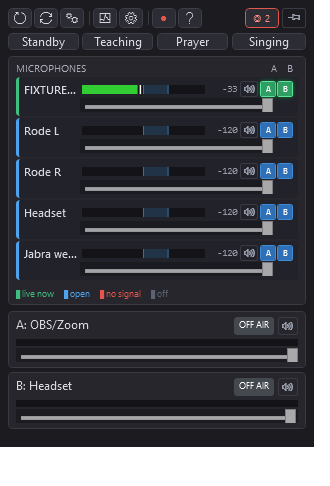

# AudioMixer

A Windows desktop mixer for a small AV rig: **1–10 microphones → 2 output buses**, typically a
monitor headset and Zoom/OBS via VB-CABLE. It was built for a church meeting room where volunteers
run the service alone, so the guiding rule is that the app should be on autopilot — the operator
routes and mutes mics as on any desk, and the app decides which of the open mics is on the stream.

Its real job is **choosing which microphone is on the stream**. In a room covered by several mics,
every talker is picked up by all of them at different distances, and simply summing them gives
comb-filter "echo", a raised noise floor and reverb. The automixer keeps one mic open and mutes the
rest, holding its choice so a pause cannot hand the room to a distant mic.



## The four windows

| Window | What it is for |
|---|---|
| **Operator panel** | The mixer. The Singing toggle and the priority-mic picker, one row per mic (state stripe, meter with target band, level, mute, bus A/B that lights when the automixer picks it), an on-air card per bus, one toolbar. |
| **Checks** | Everything needing attention, and nothing that is merely fine. It opens itself only when something is wrong, so its appearance is the signal. Each item offers a button that does the fix where one exists. Never blocks. |
| **Diagnostics** | Why this mic (ranked, with the deciding numbers) · the session so far · calibration · devices. Never needed to run a service. |
| **Settings** | The rig: each strip's device and split side, automix mode per bus, the bus leveler, the global low-cut, device-picker filters. |

## The two decisions on the operator panel

Everything else — which mics are open, on which bus, muted or not — the operator sets directly on the
mic rows. Two things are not obvious enough to leave to memory, so they get their own controls:

- **Singing** — turns follow-the-talker **off** on both buses. With a congregation singing there is no
  single talker to follow, so follow-the-talker chops. Every routed mic stays open; tap again when the
  speaking resumes. The line under the button says what the automixer is doing right now.
- **Priority mic** — the one mic (normally the presenter's lapel) that is never switched off and that
  ducks the others while it is speaking. One at a time, and "(none)" when nobody is wearing it.

There used to be four scene buttons (Standby, Teaching, Prayer, Singing). They were removed in
2026-09: nobody could remember what each did, and because a scene rewrote every mute and route it
silently undid the operator's own changes.

## Choosing the microphone

Per output bus, **Off** or **Gate**:

- **Off** — every routed mic passes at unity. What Singing uses.
- **Gate** — winner takes all; every other mic is muted to zero. Everything else uses this.

The winner is the loudest mic by smoothed RMS, **held**: a challenger must be about 3 dB louder
*and* the current winner must have held for ~200 ms. That hold is the actual fix for "far mic wins" —
the original bug was temporal, not a bad metric. The selector re-picked the loudest mic every 10 ms,
so a distant mic's rise during a talker's pause stole the room.

**One mic can be the lapel**, picked in Settings. It is never gated, and while the presenter is
speaking it ducks the room mics — otherwise their voice reaches the bus twice, once clean and once
delayed, and comb-filters. The duck is held for ~1.2 s across sentence gaps, and broken immediately
by a genuinely loud interjection.

A two-transmitter receiver (RØDE Wireless PRO in Split mode) is **one** audio device carrying TX1
left and TX2 right. Bind it to two strips, one set to Left and one to Right, or the automixer sees a
single blended channel it cannot arbitrate.

## Recording, and reading a service back

**Recording is always on.** It starts shortly after launch and stops itself after an hour, so nobody
forgetting to close the app can fill the disk. Files expire after 28 days, and are also deleted
oldest-first when free space is short.

Each service leaves four things under `Documents\AudioMixer\`:

| File | What it is |
|---|---|
| `analysis\diag-input{N}-{stamp}.wav` | one microphone, raw — pre-fader and pre-low-cut |
| `analysis\decisions-{stamp}.csv` | 10 Hz: automix mode and winner per bus, leveler gain, each mic's level and applied gain |
| `recordings\mix-{A,B}-{stamp}.wav` | what each bus actually sent |
| `sessions\session-{stamp}.json` | aggregates, events, operator actions, and the config to read them against |

The CSV is what makes a recording answerable. The per-mic WAVs are tapped *before* the automix gain,
so they show what each mic heard and nothing about what was done with it; the mix shows that a choice
was wrong but never what the alternative sounded like. Line the CSV up against the WAVs and "should
it have picked mic 3 at 12:04" becomes a question with an answer.

Session records are written **whether or not** anything else is recording, and kept for 90 days —
the service that matters is the one nobody prepared for. They carry aggregates, not speech.

A capture worth keeping as a replay fixture goes in `analysis\keep\`, which retention never touches.

## Other things it does

- **Bus leveler** (per output, default off) — a slow broadcast-style leveler for talkers who are
  quieter or further away. It sits *after* the automixer on purpose: compression before the selector
  flattens the level differences that say which mic is closest. Its make-up lift is capped, because
  this room's noise floor is HVAC and every dB of lift is a dB of rumble.
- **Global low-cut** (default 80 Hz) — rumble, handling and headroom. Not an S/N fix: measured, a
  high-pass moves speech-band S/N by 0.1–0.2 dB.
- **Gain calibration** — every capture buffer is tallied into 1 dB bins, voiced separately, at the
  same tap the automixer's thresholds read. The Diagnostics readout is what transmitter gain gets set
  against; a peak meter cannot do this job, because a DSP-free wireless mic's crest is ~20 dB.
- **Device memory** — a strip remembers the device it wants even while that device is unplugged, and
  re-binds the moment it reappears. Receivers that carry a hardware serial are told apart properly,
  so two identical units cannot be swapped.
- **Health checks** — every rule corresponds to a failure that actually happened and had to be
  diagnosed by hand.

## Requirements

- Windows 10 or 11
- For Zoom/OBS routing: [VB-CABLE](https://vb-audio.com/Cable/) — free. Install, reboot, set bus B's
  device to "CABLE Input", then set Zoom's microphone to "CABLE Output".

## Getting it

| | Size | Needs | Use when |
|---|---|---|---|
| **`AudioMixer.exe`** (self-contained) | ~68 MB | nothing | the default — any fresh Windows 10/11 x64 box |
| **`AudioMixer-slim.exe`** (framework-dependent) | ~0.8 MB | [.NET 8 Desktop Runtime](https://dotnet.microsoft.com/download/dotnet/8.0) | machines that already have .NET 8 |

Either way it is one file to copy. Download from the repo's **Releases** page, or build locally:

```powershell
.\publish.ps1          # self-contained -> bin\publish\AudioMixer.exe
.\publish.ps1 -Slim    # framework-dependent -> bin\publish-slim\AudioMixer.exe
```

Pushing a `v*` tag builds both on a Windows runner and attaches them to a GitHub Release. Ordinary
pushes run the tests instead.

## Running from source

```powershell
dotnet restore
dotnet build
dotnet run --project AudioMixer
dotnet test AudioMixer.sln
```

### Command line

| Flag | What it does |
|---|---|
| `--replay[=STAMP]` | Feed the inputs from a recorded session instead of live mics. A sandbox: its own instance mutex, no autosave, no output devices. Add `--seek=MM:SS --for=MM:SS --speed=N --loop`. |
| `--preset=PATH` | Load and save the preset at PATH instead of `%APPDATA%`. What makes a replay fixture reproducible. |
| `--state[=PORT]` | Serve a live JSON snapshot on `http://127.0.0.1:7077/state` — the fastest way to see the selector's reasoning without the GUI. |
| `--shots[=DIR]` | Render every window to PNG and exit. Works with the workstation locked, where a screen grab returns the lock screen. |
| `--log` | Write `%TEMP%\AudioMixer.log`, including WPF binding failures. Crashes are always logged regardless, to `%TEMP%\AudioMixer.crash.log`. |
| `--open-all` | Open every window, so one run covers all their markup. |

## Architecture

```
WasapiCapture (per input)
  → resample to 48 kHz stereo float32
  → side split (L/R for a split receiver)
  → peak + analysis taps
  → low-cut → mute → gain
  → per-output automix gain → per-output ring buffer
                          ↓
            MixingSampleProvider (per output bus)
                          ↓
            bus leveler + limiter → peak tap → recorder tap → volume
                          ↓
                WasapiOut (per output device)
```

- **48 kHz stereo float32** internally; every capture resamples to it.
- **WASAPI shared mode** everywhere — exclusive mode would lock Zoom out of the headset.
- The **side split is first**, so everything downstream sees one transmitter rather than a blend.
- The **low-cut sits after the analysis tap**, so the per-mic recordings stay unprocessed and offline
  tools never measure our own filter.
- The **leveler is the only dynamics stage**, and it is after the mixer for the reason above.
- The **automix decision loop runs at ~100 Hz off the audio threads** and writes per-channel gains
  lock-free; the channel applies them with a click-free ramp.
- **MVVM**: engine in `Audio/`, pure rules in `Services/`, view models in `ViewModels/`, four windows
  in `Views/`.

Anything that makes a judgement — health rules, the routing guard, the automixer, session aggregates —
lives in a pure function so it can be unit-tested. Nearly 400 tests cover that layer; anything
needing a device or a window is exercised by a replay run instead.

## File locations

| What | Where |
|---|---|
| Settings (auto-saved) | `%APPDATA%\AudioMixer\preset.json` (with a `.bak`) |
| Per-mic captures + decision track | `Documents\AudioMixer\analysis\` |
| Bus recordings | `Documents\AudioMixer\recordings\` |
| Session records | `Documents\AudioMixer\sessions\` |
| Kept replay fixtures | `Documents\AudioMixer\analysis\keep\` |
| Log (opt-in) / crash log (always) | `%TEMP%\AudioMixer.log` / `%TEMP%\AudioMixer.crash.log` |

## Known limits

- Latency is the WASAPI shared-mode floor plus our jitter buffer. Sub-30 ms is not reachable through
  this stack without ASIO and exclusive mode, which would conflict with Zoom.
- Two outputs on the same physical device is allowed but quirky; preset load keeps the first and
  clears the second.
- WPF does not trim reliably, so the self-contained exe cannot get much below its current size.
- Congregational singing through gating speakerphones cannot be fixed by any mix strategy — the
  dropouts are in every source at once. See the measured findings in `CLAUDE.md`.

## License

Licensed under the **GNU General Public License v3.0** — see [LICENSE](LICENSE).

Copyright (C) 2026 Wim Kerkhoff

This program is free software: you can redistribute it and/or modify it under the terms of the GPL as
published by the Free Software Foundation, either version 3 of the License, or (at your option) any
later version. It is distributed in the hope that it will be useful, but WITHOUT ANY WARRANTY;
without even the implied warranty of MERCHANTABILITY or FITNESS FOR A PARTICULAR PURPOSE.
